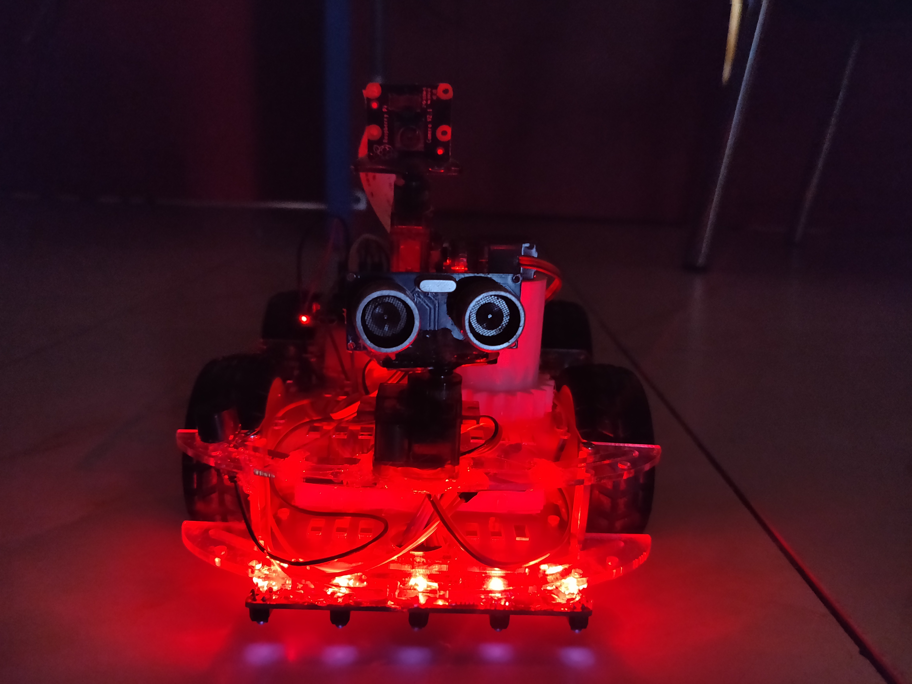
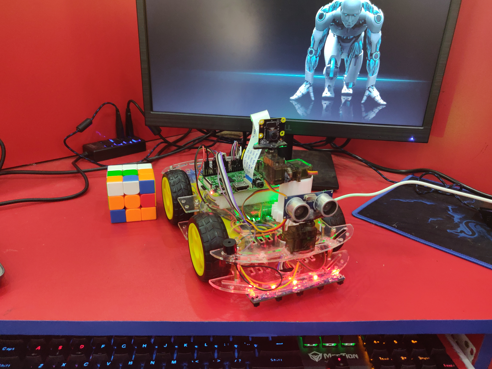

# Autonomous Pi Car

 <a href="#piCar">Introduction</a> 
 <a href="#Features">Features</a> 
 <a href="#Device">Component and Device</a> 
 <a href="#Contribution">Contributions</a> 
 <a href="#Instalation">Instalation</a> 
 <a href="#languageTools">Language and Tools</a> 
 <a href="#Diagram">Robot Diagram</a> 

**Multifunctional Autonomous Car using python and Raspberry Pi 3**

<h2 id="Features">Features</h2> 

  - [X] Line Following using array ir
  - [X] Mobile Control
  - [X] Laptop keyboard control
  - [X] Avoid obstable mode
  - [X] Following a path using camera
  - [X] Human Face Following
  - [X] control remotely with video 
  - [X] Vitual road following

 

 

<h2 id="Device">Component and Device</h2>

1. **Raspberry Pi** 
2. **Servo Motors** 
3. **DC Motors** 
4. **Ultrasonic Sensors** 
5. **LCD Display** 
6. **Gyroscope sensor**
7. **Gps Tracker** 
8. **5 array ir sensor**
9. **step down bulb converter**
10. **BMS**
11. **Buzzer sound**
12. **Motor driver**

<h2 id="Contribution">Looking for contributors!</h2>
Looking for contributors to help build out the Robot. There are a lot of work to do. This would be a good oppurtunity to learn Robotics, ROS, Machine Learning and how to Engineer an entire Robot system from the ground up. You can add your any idea to our project.

 

### Contribution guidelines 
Follow these algorithms to contribute to the voice assistant project. 
- Fork this repository 
- Add your any idea to the project. Or 
- Select your comfortable issues given in issues feature [click here to see the issues](https://github.com/devjewel01/Robot-Niko).
- Try to solve the mentioned issues and make a pull request by using branch folder 🌿 .
- Stricly maintain the clear commit name and message.
- Make a pull request to this repository ❤

 

<h2 id="languageTools">Language and Tools</h2>

| Python |  Bash | Terminal | Raspberry Pi | 
| ------ | ------| -------- | ------------ |
|||||

 

<h2 id="Diagram">Autonomous Pi Car</h2>

